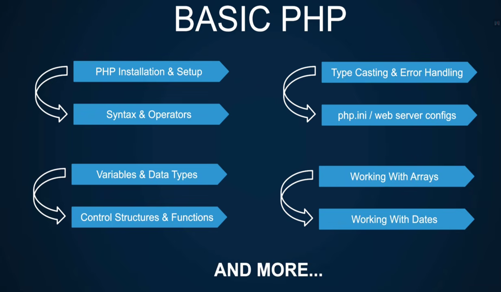
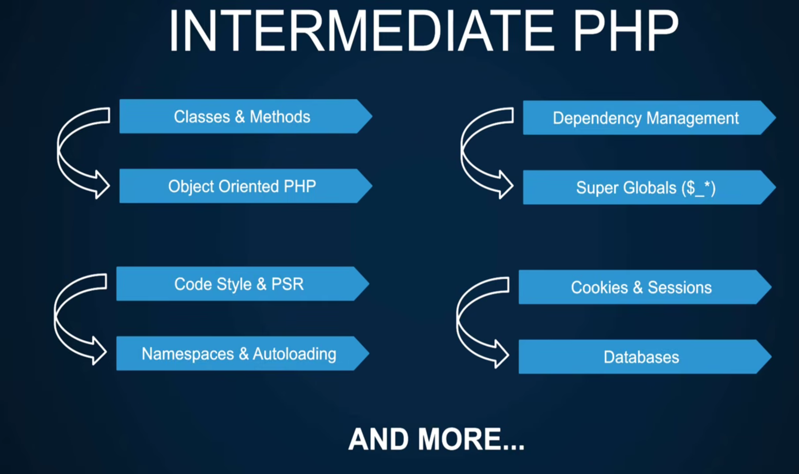
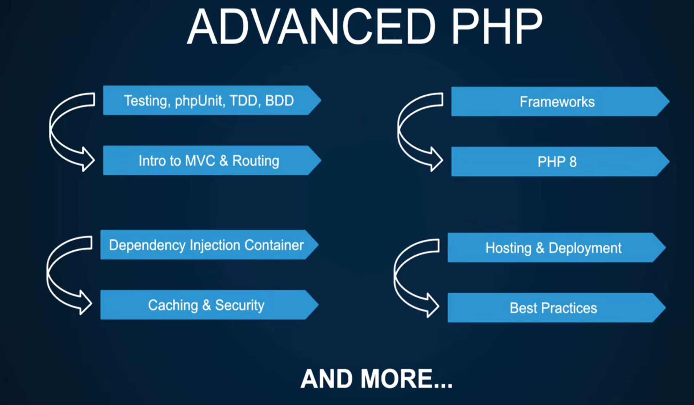

## How to navigate this repro <!-- markdownlint-disable-line MD041 -->

- this repo is devided into mutible folder prefixed with section
- each section has it's own dedicated notes and projects
- the programing folder at the beginner_section is a symilink folder coresponding the htdocs folder inside XAMPP
- I may left notes here and there to describe something or location I will also mention the coresponding concept
- Although not decided but I may transition into different a web server or a docker if the course did

> to be honest I mainly use obsidian as my notes app so if you find any weird syntax make a PR on it I will try too read it

## introduction

- php stands for hypertext preprocessor and its a scripting language meaning it's interpreted direcrtly unlike programming languages which require a compiler that translate it into machine code like `java, c++`
- unlike javascript which runs inside the client server i.e ***browser***, php needs to run inside a **web server**

> [!example "how does php runs"]
> client(==the browser==) send a request to the web server which then interprets and process php
> it can also do ather thing like connecting to a database, apis and so on
> it finally send the response back to the client

### php pros

- easier to get started and begginer frinedly
- powerful cli tools
- grat and amzing ecosystems
- can build websites and web app

### php cons

- simplicity leads to bas code but will stil work fine

### is it dead

- it powers 75% of the web so fuck who think that

## course overview

php concept can be divided into three levels which are

### 1.basic

### 2.intermediate

### 3.advanced

## installation

### installing a web server

to install php you neew a a web server common and popular one are

- apache server
- nginx
both of them have there pros and cons that will be covered later but we will use apache web server

### installing the php

1. in the os
    - manual installation of a web server
    - manual installation of a database
    - a lot of manual configuration
    this is probably not beginner friendly

2. all in one solution
    - contains a pre-installed web server like apache
    - contains a pre-installed database like MySQL
    - pre-configured
    like XAMPP / MAMP / WAMP all with there pros and cons

3. virtual machines and docker
    - better alternative
    covered in a seperated video

>[!NOTE "XAMPP as a starting point"]
> we will stick with XAMPP for now but it itself have many cons like:
>
> - setup comes only with one version of php and correspondingly one version for the Database running
> - it's not a good choice when it come with security and production developement
